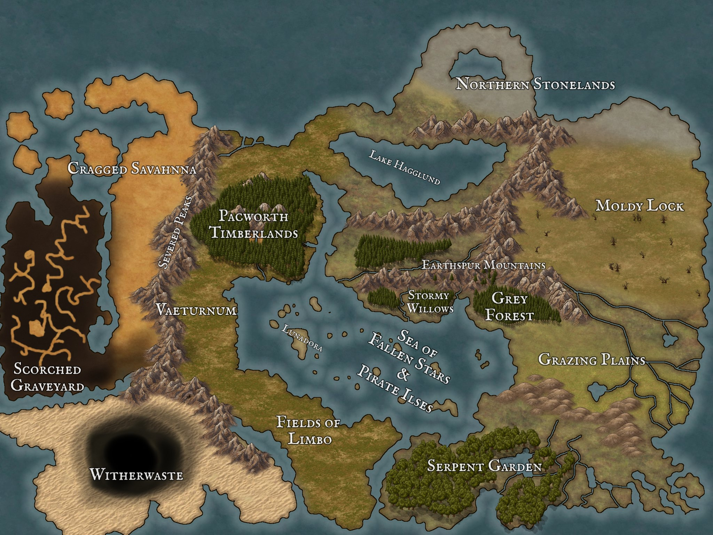

# Overview 
Glaushun has 3 seasons, hot, cold, transition. The hot and cold seasons are each 4 months long and the transition seasons are each 2 months long but each season is moderately temperate. Overall this should be the most diverse continent with a "melting pot feel" similar to America and west asia/middle east. From the [Age of Division](../../../History/age-of-division.md) on this was an essentially abandonded continent, dotted with relics and the sole survivor of that age in the Pharoh of Dust. This is why it was used as the main battlefield for the war of elements and still holds great impact from that cosmic game. It is clear to see immigration patterns of the other continents throughout the land in the [age of myth](../../../History/age-of-myth.md). Kobolds sailed south to the cragged savahnna from the rust woods, and [hopeless expanse](../Ikothon/hopeless-expanse.md). Goliaths immigrated to the [northern stonelands](northern-stonelands.md) and large amounts of animal kin founded cities in the Grazing Plains and moved in to the [serpent gardens](serpent-garden.md). The interior still holds some ancient settlements of elves and dwarves tucked and isolating themselves, however most of the settlements are not yet developed into nations and are the remnants of fortresses and citadels built for wartime. Due to their nature large chunks of land was hoarded by dragons who still kept giants or geniekin under their rule. Some of the humanoids in the area gained independence through rebellion like [Vaeturnum](vaeturnum.md). 

