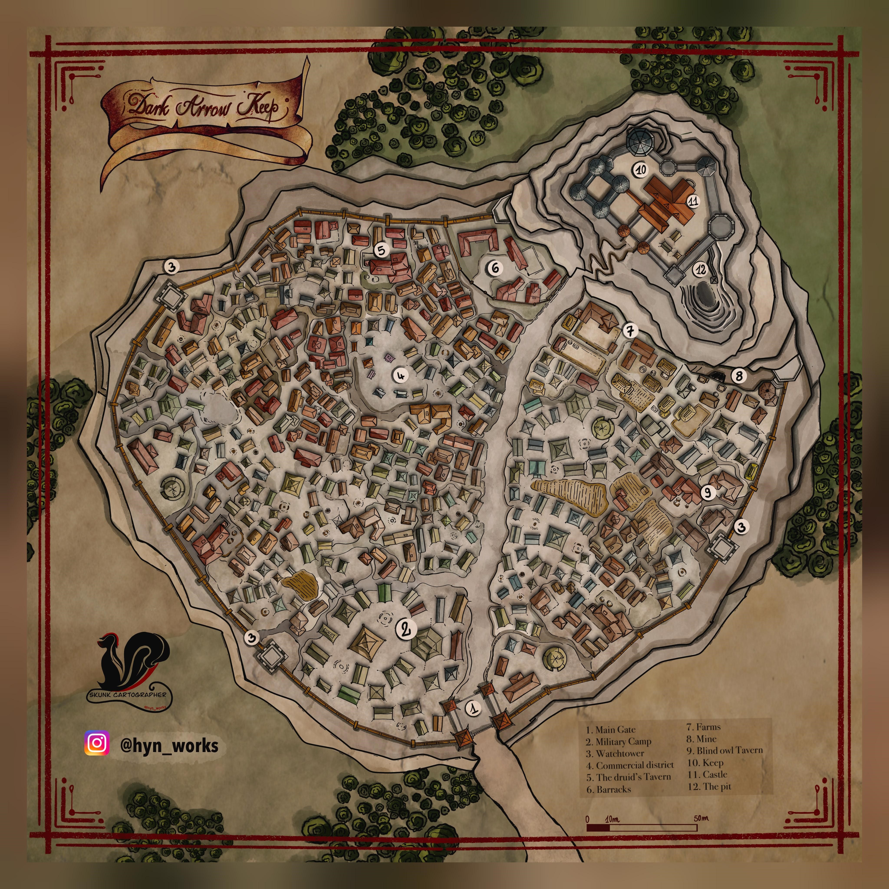

# Steel Citadel
Hobgoblin empire in the north eastern [stormy willows](stormy-willows.md) and eastern earthfast mountains. 

Hobgoblin/goblin empire expanding in the [Stormy willows](stormy-willows.md) (full of willow trees) 
- Population is probably ~5,000 total 
- They recently delved into the monastery catacombs with the help of Ivan, The Howling Wind, and stole several ancient scrolls.  
    - Stealing these uncovered the ancient secret to using a special metal tempered with dragon's blood in order to create the Vorpal quality.  
    - As well as the process of creating drakes.  
    - And the process to summoning tunnel ants to mine the mountains and underground so the goblinoids don’t do it themselves 
- Allied with a mad ancient green dragon named Curdelgyth, The Dream Carnivore who’s sanity was lost when consumed a powerful dark archfey of the unseelie court and now the dragons claws attacks steal life force (vampiric touch / reduce max hp) (taking it out on elves in order to find feywild connection to take revenge) 
    - See [Lure of Jaws](lure-of-jaws.md) for more information on her.
    - Allow hobgoblins to use its scales to create green drakes 
    - The one surviving spawn of this dragon was the original reason for the confrontation as the dark archfey forcefully transformed a young green dragon child into a jabberwock 
- Ruled by queen Zundrak, The Razor (see below) 
    - Main keep is deep in the forest backed against the mountains 
    - Main keep has roughly 3,500 permanent inhabitants. The rest are out conquering, pilaging, etc.
    - 16 Bands of 25 soldiers are their infantry / mobile forces 
        - Each group has: 
        - 1 Hobgoblin Warlord 
        - 2 Hobgoblin captains 
        - 3 green drakes ridden by those above 
        - 4 hobgoblin devastators 
        - 15 hobgoblins 
            - All basic troops carry what looks like a six pack of beer. Six glass bottles can be tossed or drank. 
                - 6 potions: 
                    - 1 potion of greater healing 4d4+4 
                    - 4 random elemental explosions (3d8+6 elemental damage roll 1d8 chaos bolt damage type. 
                    - 1 smoke bomb that fills a 25ft sphere with dark heavily obscured smoke.  
    - 100 Hobgoblin Iron shadows works as spys, infiltrators, assassins working in small groups 

## Army of Steel Sovereignty
### General: Zundrak, The Razor (LE Female hobgoblin paladin 20) 

Zundrak uses brutal but efficient tactics to expand the new hobgoblin nation's territory. She passed the tests of the lure of jaws by herself and the mad ancient green dragon took great interest in her. Now funding the founding of a hobgoblin nation with promise of expanding Curdelgyth's hoard. She is a hobgoblin with pale red skin, a shaved head, and dark red eyes. With powerful artifacts, allys, and two kinds of hoards she plans to create the first true goblinoid nation. The elves, dwarves, and other humanoids around are paranoid of the militarist nation that hungers for expansion. 

Curdelgyth allowed Zundrak to take one of her more precious treasures. An onyx key, a gateway to the Crystal crossroads which Zundrak is using to connect with goblinoids nations across the globe and rapidly expand her empire 

### Commanders: 5 Commanders report directly to Zundrak and lead a leigion of their own 

**Vruc** (Hobgoblin blood hunter) Leads specialist missions scar from forhead to jaw. 

**Netuhs Ijod**(Ja Noi Samurai General/Secretly a Fire Yai) Zundrak's right hand commander of army, was first ally Zundrak made on Bredoa after she discovered the Crystal Crossroads 

**Dradac**, The monster: (Barghest War Cleric) Religious leader (commands war preists and black guards known as the Imperial Blades) 

**Lurdug** (Bugbear) Leads the iron shadows 

**Alzor**, (Goblin Alchemist) Zundraks personal advisor, expert in all things alchemical and arcane, absolute fucking nutjob 

### Lower ranks
**Lieutenants**: Ironfang Legion lieutenants each command a large number of sergeants and support personnel. Most lieutenants are responsible for a single strategic objective, such as defending a fortification or taking a town. Lieutenants are usually given broad latitude in meeting these objectives, and most are individualistic and powerful 

**Specialists**: Set outside the rank-and-file hierarchy, specialists are elite experts of the Legion, and include master trackers, regional guides, and spymasters. Specialists report directly to a commander such as Vruc or even Azaersi herself. Specialists are more likely to be drawn from races other than hobgoblins, and include creatures as strange as monstrosities ,fiends, and even evil fey creatures. 

**Sergeants**: Commanding groups of troopers, sergeants are responsible for specific tactical objectives such as burning a bridge or occupying an inn. The specific number of troopers under each sergeant varies, as befits the task and the sergeant’s skill. 

**Troopers**: The rank-and-file soldiers of the Ironfang Legion gather in great numbers to enact the objectives set by their leaders. Although most troopers are hobgoblins, troopers might also be bugbears, worgs, goblins, orcs, and even a few hill giants. The most highly regarded troopers are the hobgoblin grenadiers, whose battlefield explosions and healing extracts are critical to the Legion’s plans. 